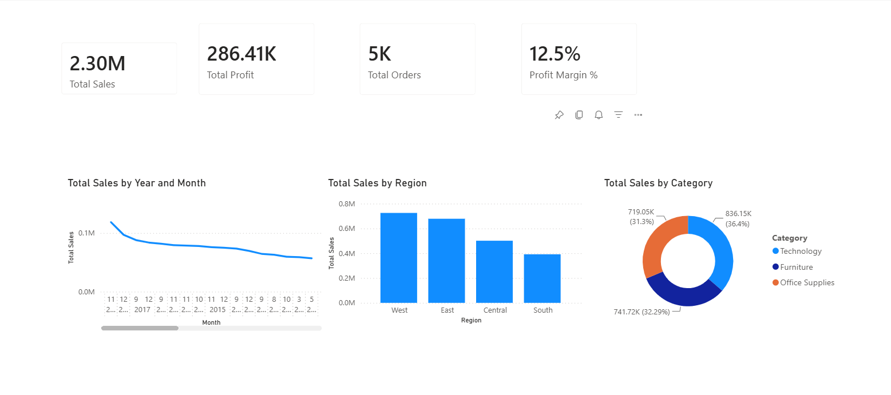
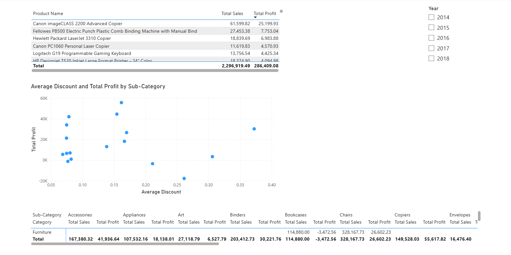
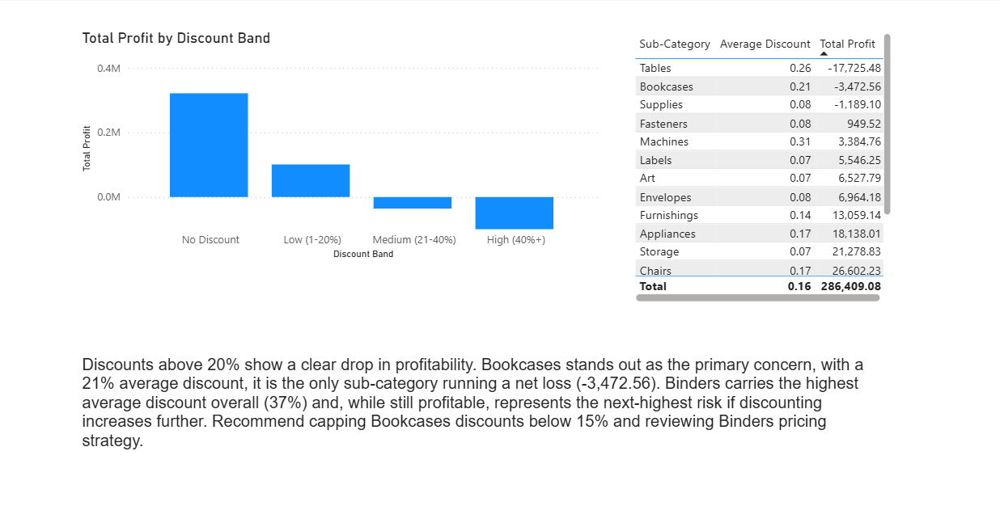

# 📊 Retail Business Performance Dashboard

[](https://powerbi.microsoft.com/)
[](https://www.python.org/)
[](https://pandas.pydata.org/)
[](https://www.microsoft.com/en-us/microsoft-365/excel)
[](https://learn.microsoft.com/en-us/dax/)
[]()

End-to-end data analytics project simulating a business reporting workflow, from raw transactional data to a decision-ready Power BI dashboard, ad hoc analysis, and stakeholder insights memo. Built to mirror the responsibilities of a corporate Data Analytics Intern role: data cleaning, dashboard development, and data-driven recommendations.

## 🎯 Problem Statement

Simulate a business reporting cycle for a retail division: collect and clean raw sales data, build a proper data model, and deliver dashboards and ad hoc analysis that support real business decisions, not just charts, but findings a manager could act on.

## 🛠️ Tools Used
- **Excel** — Power Query, pivot tables (initial cleaning pass)
- **Python** — pandas (data validation, calculated fields, exploratory analysis)
- **Power BI** — Power Query, DAX, star-schema data modeling, dashboard design

## 🏗️ Architecture


Raw data is cleaned in Excel first, independently re-validated and enriched in Python, then modeled in Power BI as a star schema and surfaced through a 3-page interactive dashboard.

## 📁 Project Structure

```
retail-business-performance-dashboard/
├── .gitignore
├── README.md
├── requirements_doc.md
│
├── data/
│   ├── raw/
│   │   └── superstore.csv
│   ├── cleaned/
│   │   ├── superstore_cleaned.csv
│   │   └── superstore_cleaned_python.csv
│   └── data_dictionary.md
│
├── excel/
│   └── 01_data_cleaning.xlsx
│
├── python/
│   ├── 01_clean_data.py
│   ├── 02_validation_checks.py
│   └── 03_eda.ipynb
│
├── powerbi/
│   └── business_dashboard.pbix
│
├── reports/
│   ├── insights_memo.md
│   └── ad_hoc_analysis.md
│
└── docs/
    ├── architecture_diagram.png
    └── screenshots/
        ├── executive_summary.png
        ├── product_analysis.png
        └── ad_hoc_analysis.png
```

## 🔄 Data Pipeline
1. **Excel cleaning** — type corrections, duplicate removal, text trimming, initial pivot-based sanity checks
2. **Python validation** — independent re-check of nulls, duplicates, and value ranges; found and resolved 1 true duplicate order line (out of 16 initially-flagged Order ID + Product ID matches); added Profit Margin, Order Year/Month, Shipping Days, and Discount Band calculated fields
3. **Power BI modeling** — flat table split into a star schema: Fact_Sales plus Dim_Product, Dim_Customer, Dim_Location, and a generated Dim_Date calendar table
4. **DAX measures** — Total Sales, Total Profit, Total Orders, Average Discount, Profit Margin %
5. **Dashboard** — 3 pages: Executive Summary, Product Analysis, Ad Hoc Analysis

## 📈 Dashboard Pages
- **Executive Summary** — top-line KPIs, monthly sales trend, sales by region, sales by category
- **Product Analysis** — top products by profit, category/sub-category drill-down matrix, discount-vs-profit scatter, year/region slicers
- **Ad Hoc Analysis** — direct response to a simulated stakeholder question on discounting's effect on profitability, with a written recommendation

## 💡 Key Findings
1. West and East regions drive the majority of sales; South consistently underperforms.
2. Category mix is well balanced — Technology (36.4%), Furniture (32.3%), Office Supplies (31.3%).
3. Discounting above ~20% correlates with a sharp drop in profit. Bookcases is the only sub-category running a net loss (21% avg. discount, -3,472.56 profit); Binders carries the highest average discount (37%) and remains profitable but warrants monitoring.

Full detail in [`reports/insights_memo.md`](reports/insights_memo.md) and [`reports/ad_hoc_analysis.md`](reports/ad_hoc_analysis.md).

## ✅ Data Quality Process

All cleaning decisions, validation checks, and edge cases (including the duplicate-resolution logic) are documented in [`data/data_dictionary.md`](data/data_dictionary.md).

## 🖼️ Dashboard Screenshots

**Executive Summary**


**Product Analysis**


**Ad Hoc Analysis**


## 👤 Author

Dunith Athukorala — [GitHub](https://github.com/Dunith-Code)